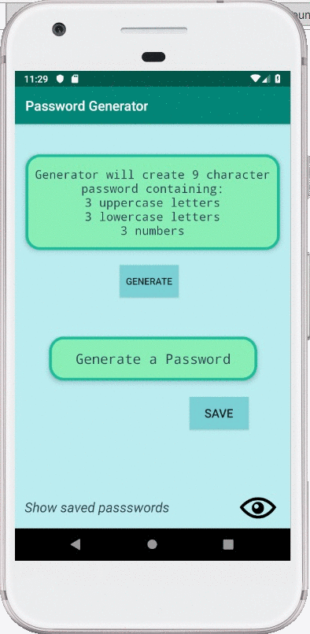

# *Password Generator* - Android App

**Password Generator** is an app that generates an intricate, *9-character* password composed of *3 uppercase letters*, *3 lowercase letters*, and *3 digits*.

## User Capabilites

Users can successfully:

* [x] Save their generated passwords to their personal list
* [x] Name every password to keep track of where each password is used
* [x] Delete any unwanted password from their saved list

## GIF Walkthrough

Here's a walkthrough of the app and its capabilities:

## Notes

**Password Generator** was created by Daniel Gonzalez.
Any feedback is appreciated.

## License

    Copyright 2018 Daniel Gonzalez

    Licensed under the Apache License, Version 2.0 (the "License");
    you may not use this file except in compliance with the License.
    You may obtain a copy of the License at

        http://www.apache.org/licenses/LICENSE-2.0

    Unless required by applicable law or agreed to in writing, software
    distributed under the License is distributed on an "AS IS" BASIS,
    WITHOUT WARRANTIES OR CONDITIONS OF ANY KIND, either express or implied.
    See the License for the specific language governing permissions and
    limitations under the License.
